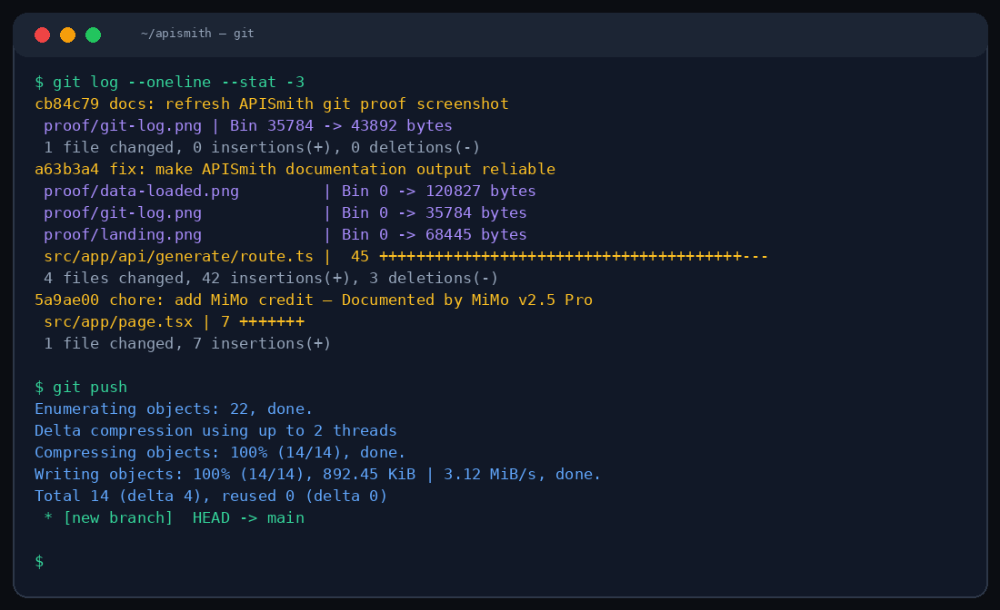

# ⚡ APISmith
\n🚀 **[Live Demo](https://apismith.vercel.app)**

Stop writing API docs by hand. APISmith takes your endpoints — method, path, headers, body, response — and generates full Markdown documentation with curl examples, error codes, and rate limiting info.



## The workflow

```
1. Define your endpoints in the visual builder
2. Add headers, request body, response examples
3. Hit "Generate Docs"
4. Get structured API documentation in seconds
5. Copy or export as .md file
```

## Built-in features

- Endpoint builder with method selector (GET/POST/PUT/DELETE/PATCH)
- Header management (key-value pairs)
- Request/response JSON editors
- AI-generated documentation with:
  - Overview + authentication section
  - Per-endpoint descriptions with parameters
  - Curl examples
  - Error response codes
  - Rate limiting documentation
- One-click copy & Markdown export
- Sample API loader for quick demo

## Stack

Next.js 16 · Tailwind CSS 4 · TypeScript · MiMo v2.5 Pro

## Run it

```bash
npm install
# optional: set MIMO_API_URL and MIMO_API_KEY in .env.local
npm run dev
```

## File structure

```
src/
├── app/
│   ├── api/generate/route.ts     # Documentation generation
│   ├── page.tsx                  # Two-panel builder UI
│   ├── globals.css               # Dark crimson theme
│   └── layout.tsx
```

## Theme

Dark mode with crimson red accents (#dc2626). System monospace fonts, "SYSTEM ONLINE" status indicator, red glow effects. Designed to feel like a developer dashboard.

---

Powered by **MiMo v2.5 Pro** from Xiaomi. [Learn more →](https://huggingface.co/XiaomiMiMo)

*Crafted with MiMo v2.5 Pro*

MIT License
